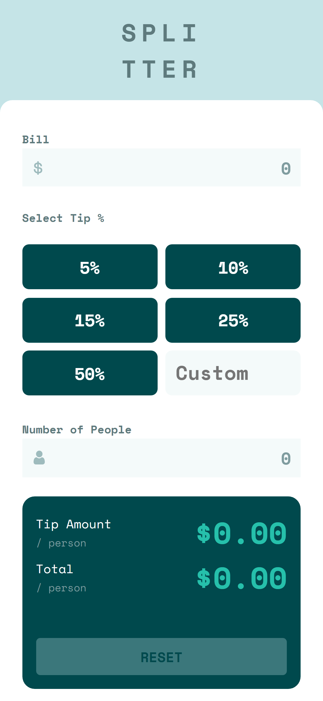
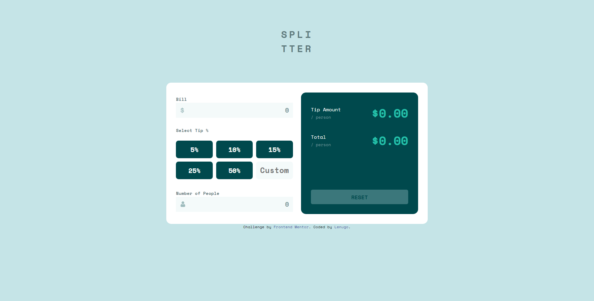

# Frontend Mentor - Tip calculator app solution

This is a solution to the [Tip calculator app challenge on Frontend Mentor](https://www.frontendmentor.io/challenges/tip-calculator-app-ugJNGbJUX). Frontend Mentor challenges help you improve your coding skills by building realistic projects.

## Table of contents 📋

- [Overview](#overview)
  - [The challenge](#the-challenge)
  - [Screenshot](#screenshot)
  - [Links](#links)
- [My process](#my-process)
  - [Built with](#built-with)
  - [What I learned](#what-i-learned)
  - [Continued development](#continued-development)
- [Author](#author)

## Overview

### The challenge

Users should be able to:

- View the optimal layout for the app depending on their device's screen size
- See hover states for all interactive elements on the page
- Calculate the correct tip and total cost of the bill per person

### Screenshot

##### Mobile: 375px 📱

##### Desktop: 1440px 🖥️

### Links 🔗

- Solution URL: [solution URL here](https://your-solution-url.com)
- Live Site URL: [live site here](https://lenugo.github.io/tip-calculator-app/)

## My process 🛠️

### Built with

- Semantic HTML5 markup
- CSS custom properties
- Flexbox
- CSS Grid

### Continued development

> I like the challenges of Frontend mentor, each challenge is unique and makes me learn the best of me.

## Author 👨‍💻

- Github User - [Lenugo](https://www.github.com/lenugo)
- Frontend Mentor User- [@Lenugo](https://www.frontendmentor.io/profile/Lenugo)
